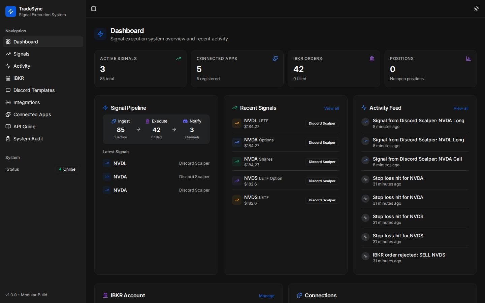
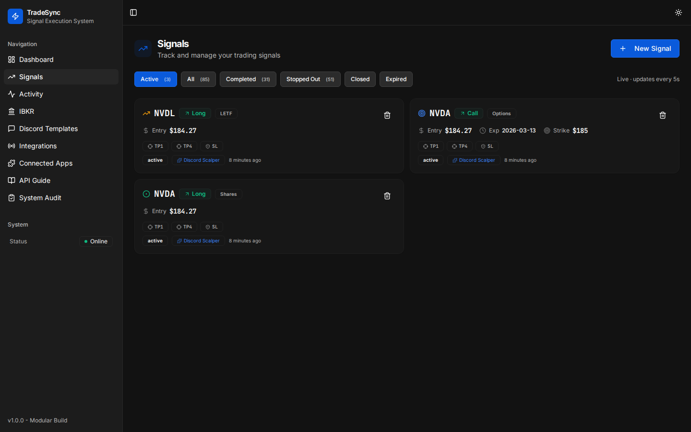
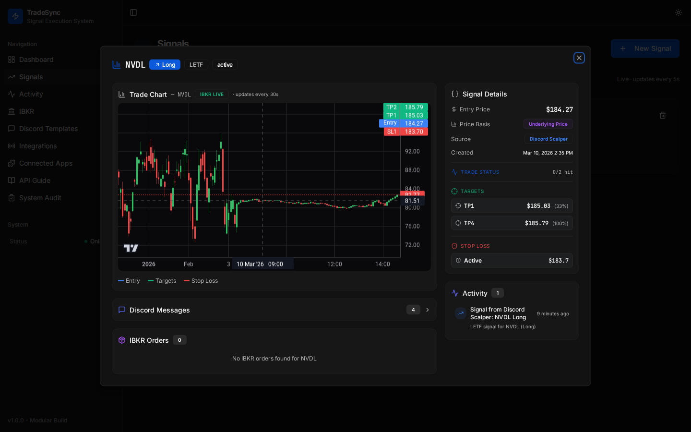
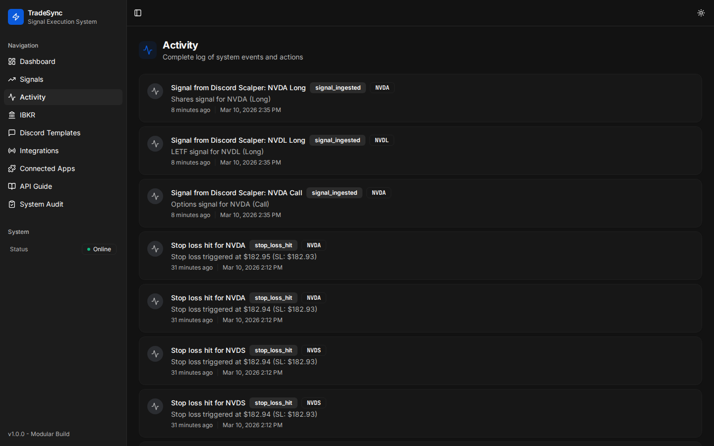
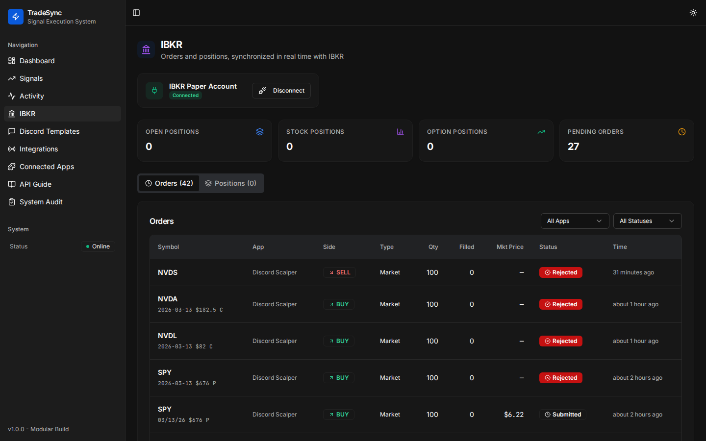
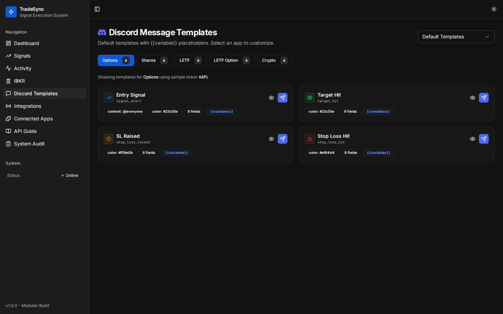
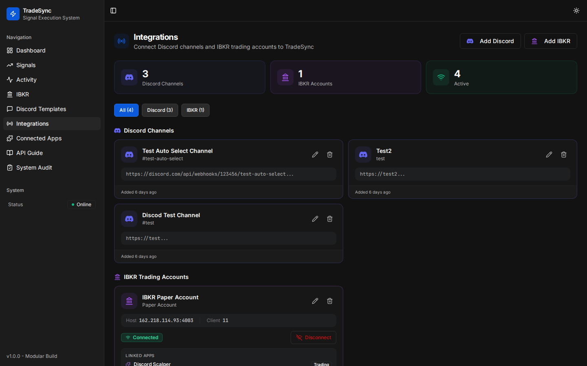
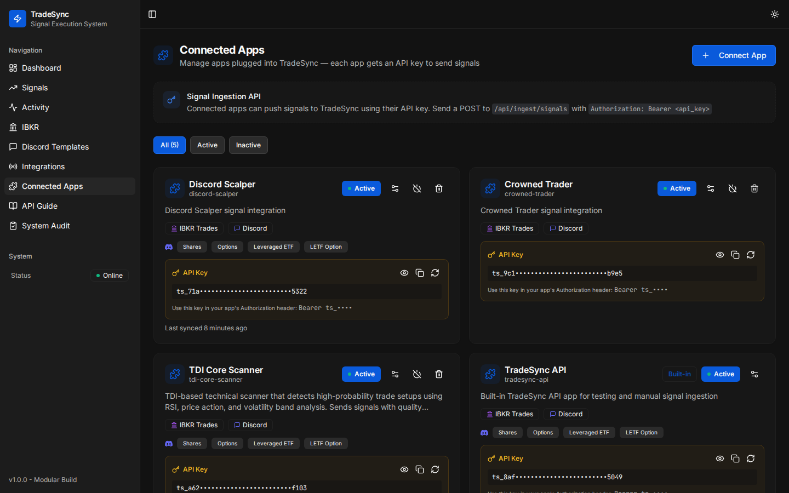
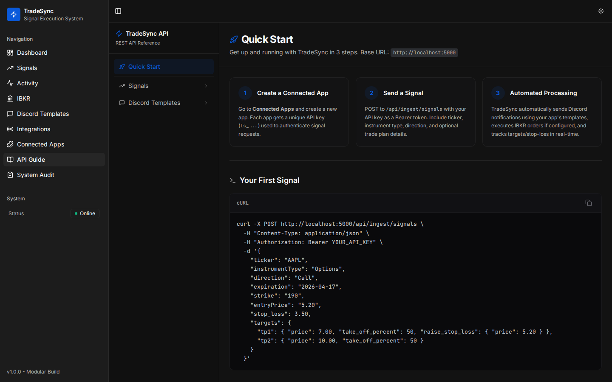
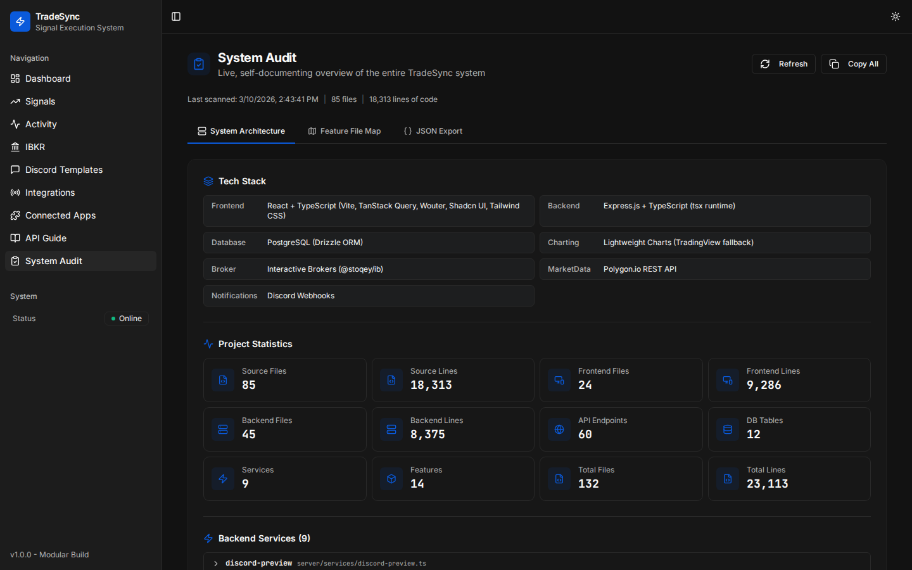

# TradeSync - Signal Execution System

A modular trading dashboard where connected apps send signals via API, triggering IBKR trade execution and Discord notifications. Supports Options, Shares, LETF, LETF Option, and Crypto instruments.

---

## Pages

### Dashboard

The main overview page showing active signals, connected apps, IBKR orders, and open positions at a glance. Includes the Signal Pipeline flow (Ingest > Execute > Notify), recent signals, and a live activity feed.



---

### Signals

View and manage all trading signals with status filters (Active, All, Completed, Stopped Out, Closed, Expired). Each signal card shows the ticker, direction, instrument type, entry price, target/stop-loss progress, source app, and status. Click "+ New Signal" to create signals manually.



---

### Signal Detail

Click any signal card to open the detail view. Features a live candlestick chart (Polygon.io data with IBKR live price updates) with entry, target, and stop-loss price lines overlaid. The right panel shows signal details, trade status with target hit tracking, and related activity. Below the chart: Discord messages sent for this signal and IBKR order history.



---

### Activity

A chronological feed of every system event: signal ingestion, Discord messages sent, IBKR orders placed, target hits, stop-loss triggers, and errors. Each entry shows the event type, description, source app, and timestamp.



---

### IBKR

Dedicated Interactive Brokers page. Shows the connected IBKR account with connect/disconnect controls, position summary cards (Open, Stock, Option positions, Pending Orders), and tabbed views for Orders and Positions. Orders display symbol, app, side, type, quantity, fill status, market price, and status with color-coded badges.



---

### Discord Templates

Configure Discord webhook message templates per instrument type (Options, Shares, LETF, LETF Option, Crypto). Four message types per instrument: Entry Signal, Target Hit, SL Raised, and Stop Loss Hit. Select "Default Templates" to view built-in templates, or select a specific connected app to customize its templates with `{{variable}}` placeholders. Each template card shows a preview button, send button, and variable list.



---

### Integrations

Manage Discord channels and IBKR trading accounts. Each integration card shows its type, connection status, and toggle switches for enabling/disabling notifications or trade execution. Add new integrations with the "+ Add Integration" button.



---

### Connected Apps

Register and manage external trading apps that send signals to TradeSync. Each app has an auto-generated API key (show/hide, copy, regenerate), per-instrument Discord webhook URLs, IBKR connection settings (client ID, host, port), and toggles for sync signals, Discord messages, and IBKR trade execution.



---

### API Guide

Interactive REST API documentation with a Quick Start guide (3-step onboarding), live cURL examples, and endpoint reference. Covers the Signals API (ingest, list, update, delete) and Discord Templates API (get, update, reset). Includes authentication details, instrument type specifications, and request/response examples.



---

### System Audit

A live self-documenting system overview that scans the actual codebase in real time. Displays a "Last scanned" timestamp with file and line counts, tech stack breakdown, project statistics (source files, lines of code, endpoints, DB tables, services, features), backend services with descriptions, and the full feature map with file locations. Three views: System Architecture, Feature File Map, and JSON Export. Hit "Refresh" to rescan the codebase on demand.



---

## Tech Stack

- **Frontend**: React, TypeScript, Vite, TanStack Query, Wouter, Shadcn UI, Tailwind CSS
- **Backend**: Express.js, Node.js
- **Database**: PostgreSQL with Drizzle ORM
- **Charting**: Lightweight Charts (TradingView)
- **Market Data**: Polygon.io API
- **Broker**: Interactive Brokers TWS/Gateway via @stoqey/ib
- **Notifications**: Discord webhooks

## Signal Flow

```
Connected App --> POST /api/ingest/signals (Bearer auth)
                        |
                  Signal Processor
                   /           \
          IBKR Orders      Discord Webhooks
          (if enabled)      (if enabled)
                \             /
              Trade Monitor (10s)
              Tracks targets & SL
                        |
              Discord alerts on hits
```

## Getting Started

1. **Create a Connected App** on the Connected Apps page to get an API key
2. **Configure integrations** (Discord webhooks, IBKR connection) on the Integrations page
3. **Send signals** via `POST /api/ingest/signals` with your API key as a Bearer token
4. **Monitor** trades on the Dashboard, Signals, and IBKR pages
